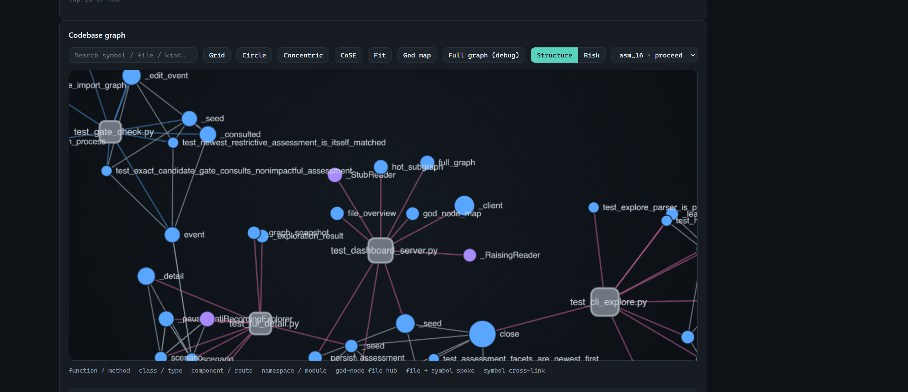
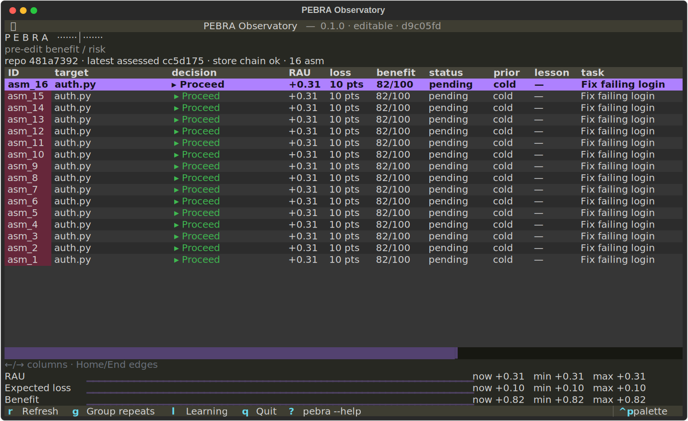

# PEBRA

**A deterministic gate that decides whether a coding agent's edit should proceed — before it's applied.**

PEBRA sits between a coding agent's proposed patch and your working tree. It computes an auditable
`expected_loss` / `expected_utility` / risk-adjusted `RAU` decision from CodeGraph-backed structural
evidence, blocks or reroutes risky edits *before* they are written, verifies the **actual** post-edit
diff against the exact candidate it approved, records the outcome, and promotes only calibrated,
measured facts back into future assessments.

[](https://github.com/Rajioba1/pebra/actions/workflows/ci.yml)
[](https://github.com/Rajioba1/pebra/actions/workflows/security.yml)


-informational)

> **Status:** Alpha. The mechanism — deterministic scoring, pre-edit gating, post-edit verification,
> calibrated promotion — is implemented and tested; PEBRA does **not** yet make a powered efficacy
> claim. The value proposition is *rigor and honest uncertainty*, not speed or accuracy numbers.

---

## The codebase graph

The read-only dashboard renders your repository as a **god-node map**: hot files become rectangle
hubs, their most-depended-on symbols become circles sized by inbound fan-in, `file → symbol` spokes
are dashed, and real `symbol → symbol` CodeGraph links are solid. Selecting an assessment overlays its
risk decision onto the exact symbols it touched (hubs stay neutral).



The same ledger is available as a terminal Observatory (`pebra tui`):



---

## Why PEBRA

- **Pre-edit, not post-hoc.** It assesses the proposed patch *before* it is applied — not a diff after
  the damage is done.
- **Deterministic math, not a vibe check.** Every decision is a reproducible function of `expected_loss`,
  `expected_utility`, and a risk-adjusted `RAU` bound — the same inputs always yield the same number.
- **Structural evidence, not guesswork.** Fan-in, blast radius across callers/implementers, and
  contract-surface changes come from a real CodeGraph index, not text diffing.
- **Verifies what actually happened.** `verify` checks the real post-edit diff against the *exact*
  approved candidate — same repo / HEAD / path is not enough; the normalized file contents must match.
- **Learns conservatively.** Outcomes are recorded, but a learned fact only influences a future
  assessment after measured calibration and gated promotion — no silent self-reinforcement.
- **Read-only observability.** A local browser dashboard and terminal TUI expose the same ledger —
  assessment history, calibration, learned facts, and the codebase graph — without ever writing to your
  repository.
- **Fails safe, not silent.** External engines (CodeGraph, `rust-code-analysis`) are explicit and
  optional; when missing or mismatched they degrade to reduced-confidence evidence rather than blocking
  an assessment or auto-installing anything.

## Quickstart

```powershell
python -m venv .venv
.\.venv\Scripts\python.exe -m pip install -e .

# assess a real example candidate edit and print the decision + math packet
.\.venv\Scripts\python.exe -m pebra assess examples/login_patch.json --json
```

That last command returns a decision — one of `proceed`, `test_first`, `inspect_first`, `revise_safer`,
`ask_human`, or `reject` — together with the full math packet (`expected_loss`, `expected_utility`,
`RAU`, `edit_confidence`, and the gates that fired) for a candidate edit, *before* anything is written
to disk.

To wire PEBRA into a coding agent (Claude Code or Codex) and open the dashboard:

```console
pebra agent-init --target claude --repo-root . --with-hook
pebra dashboard --repo-root . --open
```

> The graph tab needs a fresh CodeGraph index. It is an explicit, optional engine — never installed by
> `assess`. Set it up once with `pebra setup-graph --fix --repo-root .` and check it with `pebra doctor`.

## How it works

```text
assess proposed edit → agent decides → apply edit → verify actual diff →
record outcome → learn (shadow) → promote calibrated facts → future assess uses them
```

`assess` computes, in order — and generated agent instructions require *consuming* these values, never
re-deriving or overriding them:

```text
disutility_j     = max(elicited_j, criticality_value)   # for consequence-bearing events
expected_loss    = Σ_j  p_event_j · disutility_j
expected_utility = p_success · benefit − expected_loss − review_cost
utility_sd       = √(Σ variance-contribution terms)
RAU              = expected_utility − 1.28 · utility_sd
```

Ordered **decision gates** evaluate those values plus evidence (CodeGraph fan-in / blast radius,
contract-surface changes, confidence) to produce the decision. A separate **enforcement gate** then
checks that only the exact bound candidate is applied. `reject` means *reject this candidate*, not the
maintainer's goal — the agent surfaces the recorded reason and risk/benefit evidence. Recall informs
*understanding*; only separately promoted numeric facts can affect a future `assess`.

## What's inside

- **`assess` / `verify`** — pre-edit decision + math packet, and post-edit verification against the
  approved safe scope and required checks.
- **Candidate-bound enforcement** — an impactful host edit must reproduce the same normalized contents
  as the assessed patch; identical repo / HEAD / path is not sufficient.
- **CodeGraph-backed evidence** — per-symbol fan-in, DELETE file fan-in roll-up, MODIFY blast radius
  over callers/references/implementers/subclasses, contract-surface metadata, and container hierarchy
  roll-up. See [Graph evidence & caveats](docs/PEBRA_COMMAND_REFERENCE.md).
- **Learning loop** — outcome recording, shadow learning, calibration-gated promotion, scorecards, and
  learned-fact reapplication.
- **Read-only observability** — a browser dashboard (overview, score history, calibration, learned
  facts, and the god-node codebase graph) and a Textual terminal Observatory over the same ledger.
- **Provider-neutral `pebra explore`** — recalls bounded PEBRA history first, then retrieves current
  repository context from an existing graph index.
- **Benefit signal** — optional multi-language complexity + maintainability index via
  [`rust-code-analysis`](https://github.com/mozilla/rust-code-analysis); when absent it fails safe to a
  *projected* benefit and never affects risk. Setup details in [CONTRIBUTING](CONTRIBUTING.md).

## Basic workflow

```console
pebra assess request.json --json
pebra verify --assessment-id <assessment_id> --json
pebra finalize-outcome --trusted-outcome-file outcome.json --repo-root <repo_root> --json
pebra scorecard --repo-root <repo_root>
```

The generated agent protocol follows one cognitive lifecycle:

`Interpret → Recall verified lessons → Retrieve current repository context → Design → Assess → Calculate → Evaluate gates → Decide → Enforce → Apply → Verify → Record → Learn/promote`

## Agent enforcement

`pebra agent-init` installs a managed protocol for either host: Claude gets a managed
`.claude/skills/pebra-safe-edit/SKILL.md` skill and unconditional rule; Codex gets a managed
`AGENTS.md` block and the byte-identical skill. Add `--with-hook` for optional pre-edit interception,
and `--check` for inspection-only state.

Guarantees are deliberately different by host surface:

| Host surface | Reported mode | Guarantee |
|---|---|---|
| Claude skill + unconditional rule | instructions | The detailed protocol and concise non-negotiables are fully managed by `agent-init`; rerunning it restores their generated contents. |
<!-- agent-host:claude -->
| Claude Code PreToolUse hook (optional) | `configured_enforcing` | Exact enabled hook config, matching gate capability handshake, graph, and Git HEAD were observed. Candidate-bound checks deny unsupported candidates before supported structured edits; this does not prove the host invoked every event. |
| Codex managed block + skill | instructions | Existing `AGENTS.md` content is preserved around a managed protocol block, and the detailed skill matches Claude's byte-for-byte. |
<!-- agent-host:codex -->
| Codex repo-local hook (optional) | `best_effort` | Candidate-bound gate logic is installed, but repo-local hook loading remains host-dependent. |
| MCP tools | `advisory_only` | Assess/verify tools are available, but MCP alone does not intercept another host's writes. |

If graph or Git HEAD evidence is unavailable, an installed gate remains **fail-open by policy**
(`degraded_fail_open`). These are observable configuration states, not proof that a host invoked every
event, and `trusted_actor_required` is a protocol boundary, not OS-level identity authentication — a
process with shell access under the same OS account can still invoke local trusted-host surfaces. Use a
separately privileged host or operator account when resistance to an adversarial agent is required. Full
threat boundaries and multi-file candidate rules are in the
[command reference](docs/PEBRA_COMMAND_REFERENCE.md).

## Install & engines

```console
pebra --version           # 'installed' wheel vs editable checkout + source revision
pebra --help              # root help
pebra help tui            # command help
pebra help --all          # complete, parser-checked command inventory
pebra setup-graph --fix   # explicit CodeGraph engine setup (never done by assess)
pebra doctor              # graph diagnostics
```

Launch the terminal Observatory from an installed or editable checkout:

```console
pebra tui --repo-root .
```

From this repository's Windows virtual environment, the PATH-independent equivalent is:

```powershell
.\.venv\Scripts\python.exe -m pebra tui --repo-root .
```

The dashboard is read-only. On a loopback bind it defaults to token-free for local convenience; any
non-loopback bind requires a bearer token (`--auth token`).

## Validation

```powershell
.\.venv\Scripts\nox.exe -s tests lint e2e-fast
```

CI runs the test matrix (Ubuntu / Windows / macOS), lint, import-linter architecture contracts, an
installed-wheel verification, and a Playwright dashboard lane. See [CONTRIBUTING](CONTRIBUTING.md) for
the full session inventory and the [benchmarks](benchmarks/README.md) for math-oracle and learning-loop
wiring proofs (diagnostic evidence, not efficacy claims).

## Docs

- [Exhaustive command reference](docs/PEBRA_COMMAND_REFERENCE.md)
- [Contributing & development setup](CONTRIBUTING.md)
- [Security policy](SECURITY.md)
- [True e2e suite](e2e/README.md)
- [Benchmarks](benchmarks/README.md)

## License

Apache-2.0 for PEBRA's own code, with MIT-licensed vendored dashboard assets (uPlot, Cytoscape.js).
See [LICENSE](LICENSE).
