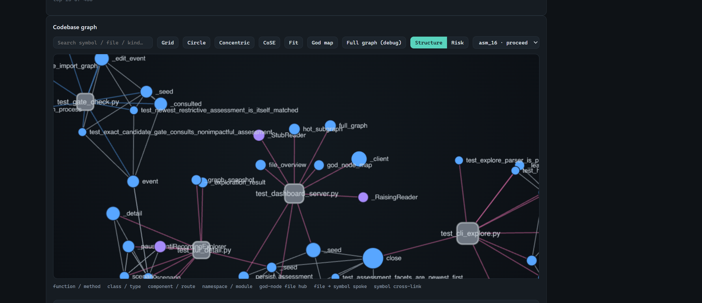
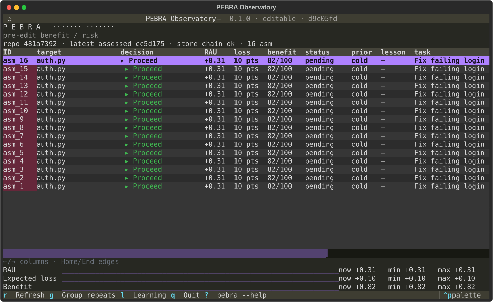
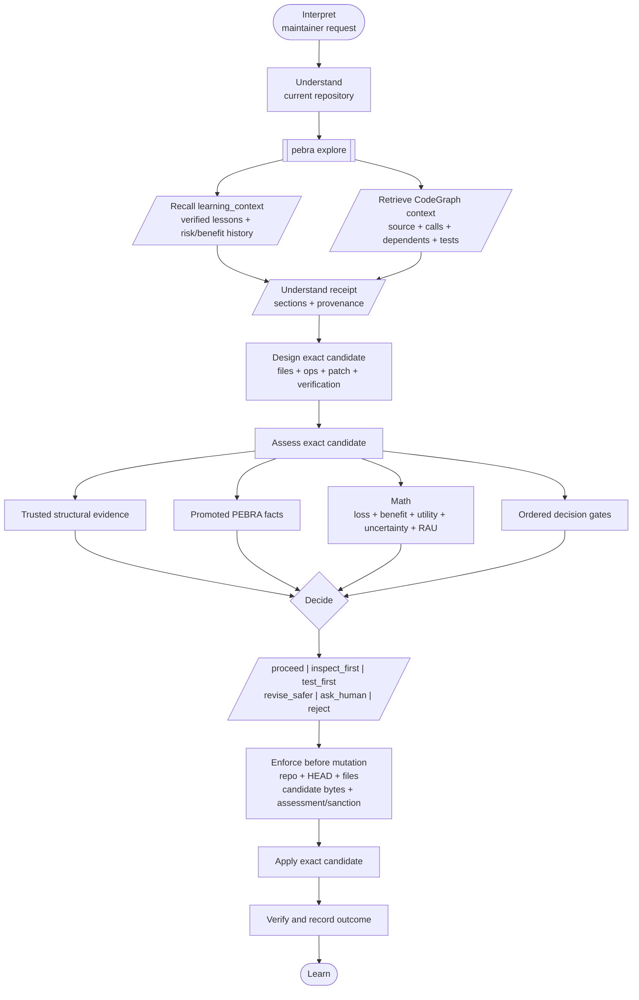

# PEBRA

**Pre-edit benefit-risk analysis for coding agents.**

PEBRA sits between a coding agent's proposed patch and your working tree. It computes an auditable
`expected_loss` / `expected_utility` / risk-adjusted `RAU` decision from structural evidence, using
CodeGraph as its standard repository-structure engine. It returns a candidate-bound decision *before*
the edit is written, can apply the exact approved candidate through `apply-candidate`, verifies the
**actual** post-edit diff against the approved envelope, records the outcome, and promotes only
calibrated, measured facts back into future assessments. Missing or stale graph evidence is reported
and never interpreted as proof that an edit is safe. With an installed host hook, the decision can
intercept unsupported or risky edits before the host writes them; without a hook, `assess` is an
advisory controller.

[](https://github.com/Rajioba1/pebra/actions/workflows/ci.yml)
[](https://github.com/Rajioba1/pebra/actions/workflows/security.yml)


-informational)

---

## The codebase graph

The read-only dashboard renders your repository as a **god-node map**: hot files become rectangle
hubs, their most-depended-on symbols become circles sized by inbound fan-in, `file → symbol` spokes
are dashed, and real `symbol → symbol` CodeGraph links are solid. Selecting an assessment overlays its
risk decision onto the exact symbols it touched (hubs stay neutral).



The same ledger is available as a terminal Observatory (`pebra tui`):



---

## Why PEBRA

- **Built for coding agents.** The intended operator is a trusted coding agent (Claude Code, Codex, or
  another host) that can inspect a repository, propose an exact patch, and consume a deterministic
  risk/benefit packet before editing.
- **Pre-edit, not post-hoc.** It assesses the proposed patch *before* it is applied — not a diff after
  the damage is done.
- **Deterministic math, not a vibe check.** Every decision is a reproducible function of `expected_loss`,
  `expected_utility`, and a risk-adjusted `RAU` bound — the same inputs always yield the same number.
- **Structural evidence, not guesswork.** PEBRA's freshness-checked CodeGraph index supplies fan-in and
  blast radius across callers/implementers; graph-side contract metadata augments the AST/change
  classifiers. If the index is unavailable or stale, PEBRA reports that loss of evidence and
  downgrades affected decisions instead of treating missing fan-in as safe.
- **Verifies what actually happened.** `verify` checks the real post-edit diff against the approved
  envelope: HEAD freshness, safe scope, change severity, contract-surface drift, and required checks.
- **Learns conservatively.** Outcomes are recorded, but a learned fact only influences a future
  assessment after measured calibration and gated promotion.
- **Read-only observability.** A local browser dashboard and terminal TUI expose the same ledger —
  assessment history, calibration, learned facts, and the codebase graph — without writing source
  files; use `--read-only` for a copied or existing database without repo-state initialization.
## How is this different?

PEBRA is not another graph viewer, memory store, or domain engine. It is the decision layer that turns
repository knowledge, historical lessons, and exact candidate bytes into an auditable pre-edit verdict.

| System | Repo graph | Memory / learning | Pre-edit risk/benefit math | Candidate-bound enforcement | Best fit |
|---|---:|---:|---:|---:|---|
| **PEBRA** | Yes: freshness-checked CodeGraph evidence | Audited `learning_context` + promoted facts | Yes: `expected_loss`, benefit, utility, uncertainty, RAU | Yes on exact `apply-candidate` and healthy configured hook paths: repo + HEAD + files + candidate bytes + sanction state | Deciding whether a coding-agent edit should proceed before it mutates the repo. |
| **CodeGraph** | Yes: symbols, calls, dependents, fan-in, affected tests | No PEBRA outcome loop | No | No | Supplying current structural repository truth. |
| **Graphify** | Visual knowledge-graph patterns | Optional overlay patterns | No | No | Exploring and presenting graph structure. |
| **AgentMemory** | No source graph by default | General agent memory | No | No | Remembering agent observations across sessions. |

- CodeGraph gives PEBRA current repository structure; PEBRA decides what that structure means for a
  specific proposed patch.
- Graphify informs PEBRA's dashboard style; PEBRA keeps risk overlays tied to fresh graph evidence and
  verified lessons.
- AgentMemory is broad recall; PEBRA recall is narrower and auditable. Recalled prose stays advisory;
  only reviewed shipped priors and separately promoted numeric facts can influence future assessment.

## Installation

PEBRA supports Python 3.11–3.13 on Windows, Linux, and macOS. Install the released CLI:

```console
python -m pip install --upgrade pip
python -m pip install pebra
pebra --version
```

For an isolated CLI installation:

```console
pipx install pebra
pebra --version
```

PEBRA checks PyPI opportunistically on human-facing commands such as `pebra --version`, `pebra help`,
`pebra dashboard`, and `pebra tui`. Results are cached outside the repository for 24 hours; machine
JSON surfaces, gate hooks, MCP, core assessment, and editable checkouts do not perform background
network checks. When a newer release is available, run:

```console
pebra update
```

`pebra update` prints the exact upgrade command by default. Use `pebra update --run` when you want
PEBRA to execute the detected `pip`/`pipx` upgrade command after interactive confirmation, or
`pebra update --yes` for an unattended upgrade command. Set `PEBRA_NO_UPDATE_CHECK=1` to disable
automatic and explicit update checks.

CodeGraph is PEBRA's standard structural engine. Set up its pinned version for the repository, verify
the index, and then wire the host you actually use:

```console
pebra setup-graph --fix --repo-root .
pebra doctor --repo-root .
pebra agent-init --target claude --repo-root . --with-hook
pebra agent-init --target claude --repo-root . --check --json
```

Use `--target codex` for Codex. When supported host markers already exist, `--target auto` installs
only the detected projections:

```console
pebra agent-init --target auto --repo-root . --with-hook
pebra agent-init --target auto --repo-root . --check --json
```

For editable development on Windows PowerShell:

```powershell
python -m venv .venv
.\.venv\Scripts\python.exe -m pip install --upgrade pip
.\.venv\Scripts\python.exe -m pip install -e .
```

On Linux or macOS:

```bash
python3 -m venv .venv
.venv/bin/python -m pip install --upgrade pip
.venv/bin/python -m pip install -e .
```

PEBRA commands themselves are terminal-agnostic; only virtual-environment paths and activation syntax
differ by shell. See the [command reference](docs/PEBRA_COMMAND_REFERENCE.md#shell-compatibility) for
PowerShell, Command Prompt, Bash, and zsh equivalents.

`codegraph.json` is operator-owned analysis scope: `extensions` and `includeIgnored` affect analysis
scope; `exclude` is reported but ignored by pinned CodeGraph 1.1.1. PEBRA never installs or updates
the engine implicitly during `assess`; engine changes require the explicit setup command above.
Installation is ready when `pebra doctor --repo-root .` reports a healthy graph and
`pebra agent-init --target <host> --repo-root . --check --json` reports the intended enforcement
mode. Continue with the Product Model and Basic Workflow below.

## Product Model

PEBRA follows a "think before acting" lifecycle. Repository knowledge comes before candidate design;
the risk/benefit math and gates come after the candidate is exact.
CodeGraph is the current structural adapter for repository truth; PEBRA-owned learning_context records
provide audited recall.


```mermaid
flowchart TB
    A([Interpret<br/>maintainer request])
    B[Understand<br/>current repository]
    X[[pebra explore]]
    R[/Recall learning_context<br/>verified lessons + risk/benefit history/]
    Cg[/Retrieve CodeGraph context<br/>source + calls + dependents + tests/]
    U[/Understand receipt<br/>sections + provenance/]
    D[Design exact candidate<br/>files + ops + patch + verification]
    As[Assess exact candidate]
    S1[Trusted structural evidence]
    S2[Promoted PEBRA facts]
    S3[Math<br/>loss + benefit + utility + uncertainty + RAU]
    S4[Ordered decision gates]
    E{Decide}
    O[/proceed | inspect_first | test_first<br/>revise_safer | ask_human | reject/]
    F[Enforce before mutation<br/>repo + HEAD + files<br/>candidate bytes + assessment/sanction]
    G[Apply exact candidate]
    H[Verify and record outcome]
    I([Learn])

    A --> B --> X
    X --> R --> U
    X --> Cg --> U
    U --> D --> As
    As --> S1 --> E
    As --> S2 --> E
    As --> S3 --> E
    As --> S4 --> E
    E --> O --> F --> G --> H --> I
```

In short:

```text
Interpret → Understand current repository → Design exact candidate → Assess exact candidate →
Decide → Enforce before mutation → Apply exact candidate → Verify and record outcome → Learn
```

`assess` computes, in order — and generated agent instructions require *consuming* these values, never
re-deriving or overriding them:

```text
disutility_j     = max(input_or_prior_j, criticality_value)   # for consequence-bearing events
expected_loss    = Σ_j  p_event_j · disutility_j
expected_utility = p_success · benefit − expected_loss − review_cost
utility_sd       = √(Σ variance contribution terms)
RAU              = expected_utility − 1.28 · utility_sd
```

Ordered **decision gates** evaluate those values plus freshness-checked CodeGraph fan-in / blast
radius, AST/change contract-surface signals, confidence, graph freshness, and policy obligations.
Missing graph evidence is explicit and never treated as a zero-risk measurement. A separate
**enforcement gate** then checks exact bound candidate bytes on `apply-candidate` and supported
configured hook paths. `reject` means *reject this candidate*, not the maintainer's goal — the agent
surfaces the recorded reason and risk/benefit evidence. Recall informs Understand; only reviewed
shipped priors and separately promoted numeric facts can affect a future `assess`.

## What's inside

- **`assess` / `verify`** — pre-edit decision + math packet, and post-edit verification against the
  approved envelope and required checks.
- **Candidate-bound enforcement** — on exact application or a healthy configured hook path, an
  impactful edit must reproduce the same normalized contents as the assessed patch; identical repo /
  HEAD / path is not sufficient.
- **CodeGraph-backed evidence** — freshness-checked per-symbol fan-in, DELETE file fan-in roll-up,
  MODIFY blast radius over callers/references/implementers/subclasses, graph-side contract metadata,
  and container hierarchy roll-up. Python contract-surface classification also uses AST/change
  evidence. See [Graph evidence & caveats](docs/PEBRA_COMMAND_REFERENCE.md).
- **Learning loop** — outcome recording, shadow learning, calibration-gated promotion, scorecards, and
  learned-fact reapplication.
- **Read-only observability** — a browser dashboard (overview, score history, calibration, learned
  facts, and the god-node codebase graph) and a Textual terminal Observatory over the same ledger.
- **Provider-neutral `pebra explore`** — recalls bounded PEBRA history first, then retrieves current
  repository context from an existing graph index.
- **Benefit signal** — optional multi-language complexity + maintainability index via
  [`rust-code-analysis`](https://github.com/mozilla/rust-code-analysis); when absent it fails safe to a
  *projected* benefit and never affects risk. Setup details in [CONTRIBUTING](CONTRIBUTING.md).

## Basic workflow

```console
# 1. Understand the current repository: recall verified PEBRA lessons, then query CodeGraph.
pebra explore "change login validation" --repo-root .

# 2. Design the exact candidate outside PEBRA, then submit that exact request.
#    request.json includes the task, files, operations, patch, expected_files, and verification plan.
pebra assess request.json --json
```

Follow the returned decision rather than treating assessment as automatic permission:

```text
inspect_first ──→ inspect → reassess
test_first ─────→ test → reassess
revise_safer ───→ revise → reassess
ask_human ──────→ trusted operator runs pebra accept-risk --apply
reject ─────────→ new route or eligible override → reassess
proceed
  ├─ requires_confirmation=true  → trusted operator runs pebra accept-risk --apply
  │                                (it reassesses and applies; do not apply again)
  └─ requires_confirmation=false → pebra apply-candidate --assessment-id <assessment_id>
```

On the ordinary proceed path:

```console
pebra apply-candidate --assessment-id <assessment_id>
pebra verify --assessment-id <assessment_id> --json
```

After successful `pebra accept-risk --apply`, Verify and Record with its returned
`reassessment_id`, never the original held ID. The approval command already applies the candidate,
so never follow it with `pebra apply-candidate`.

Record the lifecycle outcome:

```console
pebra record-outcome --assessment-id <assessment_id> --status completed
```

`record-outcome` closes the verified action lifecycle and may create bounded recall context; it does
not itself measure or promote calibration facts. MCP-submitted labels remain agent-sourced. A trusted
host can separately measure and run gated promotion from host-produced evidence:

```console
pebra finalize-outcome --trusted-outcome-file outcome.json --repo-root <repo_root> --json
pebra scorecard --repo-root <repo_root>
```

## Agent enforcement

`pebra agent-init --target auto` detects supported host markers and installs only those projections.
Explicit `--target claude` and `--target codex` remain available. Claude gets a managed
`.claude/skills/pebra-safe-edit/SKILL.md` skill and unconditional rule; Codex gets a managed
`AGENTS.md` block and the byte-identical skill. Add `--with-hook` for optional pre-edit interception,
and `--check` for inspection-only state.

Guarantees are deliberately different by host surface:

| Host surface | Reported mode | Guarantee |
|---|---|---|
| Claude skill + unconditional rule | `advisory_only` | The detailed protocol and concise non-negotiables are fully managed by `agent-init`; rerunning it restores their generated contents, but this mode does not intercept writes. |
<!-- agent-host:claude -->
| Claude Code PreToolUse hook (optional) | `configured_enforcing` | Exact enabled hook config, matching gate capability handshake, graph, and Git HEAD were observed. Candidate-bound checks deny unsupported candidates before supported structured edits; this does not prove the host invoked every event. |
| Codex managed block + skill | `advisory_only` | Existing `AGENTS.md` content is preserved around a managed protocol block, and the detailed skill matches Claude's byte-for-byte, but this mode does not intercept writes. |
<!-- agent-host:codex -->
| Codex repo-local hook (optional) | `best_effort` | Candidate-bound gate logic is installed, but repo-local hook loading remains host-dependent. |
| MCP tools | `advisory_only` | Assess/verify tools are available, but MCP alone does not intercept another host's writes. |

If graph or Git HEAD evidence is unavailable, an installed gate remains **fail-open by policy**
(`degraded_fail_open`). These are observable configuration states, not proof that a host invoked every
event, and `trusted_actor_required` is a protocol boundary, not OS-level identity authentication — a
process with shell access under the same OS account can still invoke local trusted-host surfaces. Use a
separately privileged host or operator account when resistance to an adversarial agent is required. Full
threat boundaries and multi-file candidate rules are in the
[command reference](docs/PEBRA_COMMAND_REFERENCE.md).

## Command map

```console
pebra --version           # 'installed' wheel vs editable checkout + source revision
pebra --help              # root help
pebra help tui            # command help
pebra help --all          # complete, parser-checked command inventory
```

Current command surface:

| Stage | Commands |
|---|---|
| Understand + graph evidence | `setup-graph`, `doctor`, `graph-stats`, `dependents`, `explore` |
| Candidate construction + assessment | `candidate-patch`, `assess` |
| Enforcement + application | `gate-check`, `gate-hook`, `apply-candidate`, `accept-risk` |
| Verification + learning | `verify`, `record-outcome`, `finalize-outcome`, `learn`, `promote`, `scorecard` |
| Observability + host setup | `dashboard`, `tui`, `agent-init`, `capabilities`, `help`, `--help`, `help --all`, `--version` |
| Package maintenance | `update`, `update-check` |

The exhaustive, parser-checked syntax is in the [command reference](docs/PEBRA_COMMAND_REFERENCE.md).

Launch the terminal Observatory from an installed or editable checkout:

```console
pebra tui --repo-root .
```

From this repository's Windows virtual environment, the PATH-independent equivalent is:

```powershell
.\.venv\Scripts\python.exe -m pebra tui --repo-root .
```

The dashboard routes are read-only. Normal repo-bound launch may initialize `.pebra/` state so it can
open the ledger; `--read-only` opens an existing database without repo-state initialization. On a
loopback bind it defaults to token-free for local convenience; any non-loopback bind requires a bearer
token (`--auth token`).

## Validation

```powershell
.\.venv\Scripts\nox.exe -s tests lint e2e-fast
```

CI runs the test matrix (Ubuntu / Windows / macOS), lint, import-linter architecture contracts, an
installed-wheel verification, and a Playwright dashboard lane. See [CONTRIBUTING](CONTRIBUTING.md) for
the full session inventory.

## Docs

- [Exhaustive command reference](docs/PEBRA_COMMAND_REFERENCE.md)
- [Contributing & development setup](CONTRIBUTING.md)
- [Security policy](SECURITY.md)

## License

PEBRA's own code is licensed under Apache-2.0. Bundled third-party assets keep their own notices in
[THIRD_PARTY_LICENSES.txt](THIRD_PARTY_LICENSES.txt).
